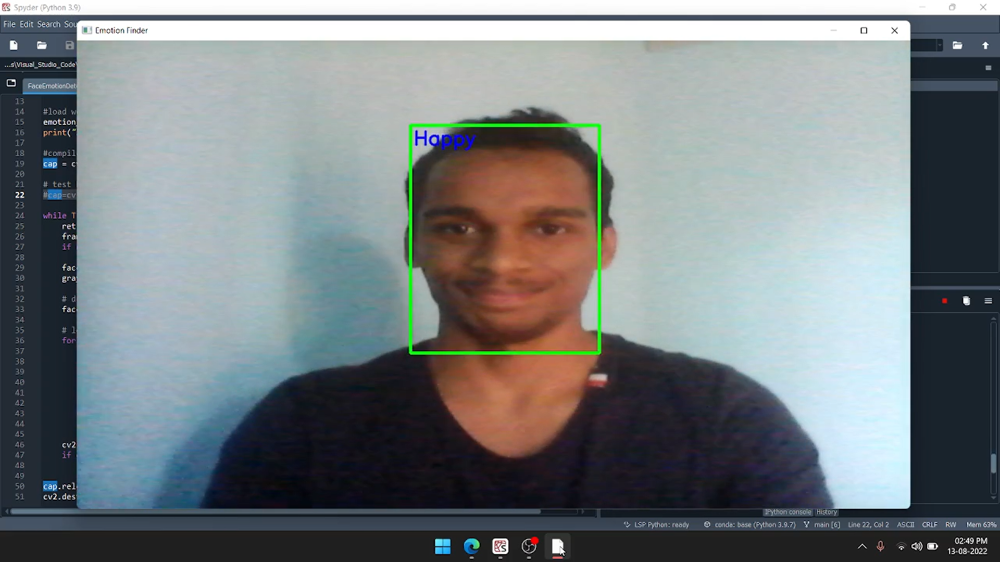

# Emotion Finder using Convolutional Neural Network

## Human Emotion detection from image is one of the most powerful and challenging research task in social communication. Deep learning (DL) based emotion detection gives performance better than traditional methods with image processing.

       --
       three main steps:
       -->face detection,
       -->features extraction
       -->emotion classification.

       --
       1 Table of Contents:
       2 Data Collection
       3 Importing required libraries
       4 Exploratory Data Analysis
       5 Data Agumentation & Preprocessing
       6 Model without Transfer Learnig
       7 Model with Tranfer Learning
       8 Model Valiation
       
## Model Architecture

## 1. Data set link

link: https://www.kaggle.com/datasets/msambare/fer2013

## 2. Required libraries

       --
       --> Keras
       --> Tensorflow
       --> Numpy
       --> OpenCV
       --> OpenCV-python
       
   

